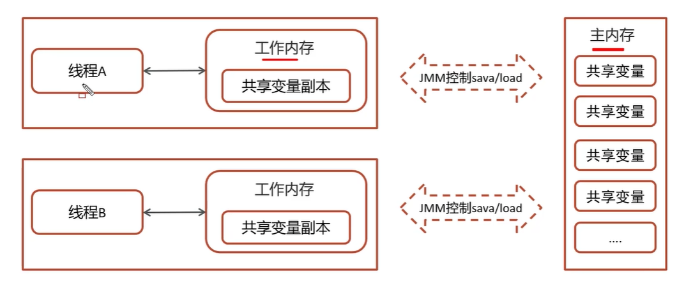

## 一、进程与线程
### 进程
* 程序由指令和数据组成，但这些指令要运行，数据要读写，就必须将指令加载至cpu，数据加载至内存。在指令运行过程中还需要用到磁盘、网络等设备。进程就是用来加载指令、管理内存、管理IO的
* 当一个程序被运行、从磁盘加载这个程序的代码至内存，这时就开启一个进程。
* 进程就是可以视为程序的一个实例。大部分程序可以同时运行多个实例进程（比如记事本、画图、浏览器等），也有的程序只能启动一个实例进程（例如网易云音乐，360安全卫士等）

### 线程
* 一个进程之内可以分为一到多个线程。
* 一个线程就是一个指令流，将指令流中的一条指令以一定的顺序交给cpu执行
* java中，线程作为最小调度单位，进程作为资源分配的最小单位。在windows中进程是不活动的，只是作为线程的容器

### 二者对比
* 进程基本上互相独立的，而线程存在于进程内，是进程的一个子集
* 进程拥有共享的资源，如内存空间等，供其内部的线程共享
* 进程间通信较为复杂
    同一台计算机的进程通信称为IPC（Inter-process communication）
    不同计算机之间的进程通信，需要通过网络，并遵守共同的协议，例如HTTP
* 线程通信相对简单，因为他们共享进程内的内存，一个例子是多个线程可以访问同一个共享变量
* 线程更轻量，线程上下文切换成本一般上要比进程上下文切换低

## 并行和并发区别
- 并发是同一时间应对多件事的能力，多个线程轮流使用一个或多个cpu
- 并行是同一时间动手做多件事情的能力，4核cpu同时执行4个线程

## 创建线程的方式有哪些
- 继承Thread类
- 实现runnable接口
- 实现Callable接口
- 线程池创建接口

### runnable和callable区别
- runnable接口run方法没有返回值
- callable接口call方法有返回值，是个泛型，和Future、FutureTask配合可以用来获取异步执行的结果
- callable接口的call方法允许抛出异常；而runnable接口的run方法的异常只能在内部消化，不能继续上抛

### run方法和start方法有什么区别
- start方法：用来启动线程，通过该线程调用run方法执行run方法中所定义的逻辑代码，start方法只能被调用一次
- run方法：封装了要被线程执行的代码，可以被调用多次

## 线程有哪些状态
- new 新建状态
- runnable 可运行状态
- blocked 阻塞状态
- waiting 等待状态
- timed_waiting 时间等待状态
- terminated 终止状态

## 线程状态之间是如何变化的
创建线程对象是新建状态，线程调用了start方法转变成可运行状态，然后线程获取到了cpu的执行权，执行结束是终止状态，如果在可运行状态的过程中，如果没有获取到cpu的执行权，可能会切换其他状态：
1. 如果没有获取到锁就会进入阻塞状态，后面获取到锁就切换为可运行状态
2. 如果线程调用了wait方法进入等待状态，其他线程调用了notify方法唤醒该线程，才切换为可运行状态
3. 如果线程调用了sleep方法，就会进入计时等待状态，到时间后可切换为可运行状态

## notify方法和notifyAll方法区别
notifyAll: 唤醒所有wait的线程
notify：只随机唤醒一个wait的线程

## 新建t1、t2、t3三个线程，如何保证他们按顺序执行
可以使用线程中的join方法解决，例如，t2线程执行方法调用了t1.join(),就会阻塞调t2线程用此方法的线程进入timed_waiting时间等待状态，直到t1线程执行完成后，t2线程才能继续执行

## wait和sleep方法的不同
**共同点**

wait()，wait(long time)和sleep(long time)的效果都是让当前线程暂时放弃cpu的使用权，进入阻塞状态

**不同点**

1. 方法归属不同
    - sleep是thread的静态方法
    - 而wait()、wait(long time)都是object的成员方法，每个对象都有
2. 醒来时机不同
    - 执行sleep(long time)和wait(long time)的线程都会在等待相应毫秒后醒来
    - wait()、wait(long time)还可以被notify唤醒，wait()如果不唤醒就一直等待下去
    - 他们都可以被打断唤醒
3. 锁特性不同（重点）
    - wait方法的调用必须先获取wait对象的锁，而sleep则无此限制
    - wait方法执行后会释放对象锁，允许其他线程获得该对象锁
    - 而sleep如果在synchronized代码块中执行，并不会释放对象锁

## 如何停止一个正在运行的线程
有三种方式可以停止线程
- 使用退出标志，使线程正常退出，也就是当run方法完成后线程终止
- 使用stop方法强行终止（不推荐，方法已作废）
- 使用interrupt方法中断线程
    - 打断阻塞的线程（sleep、wait、join）的线程，线程会抛出interruptedException异常
    - 打断正常的线程，可以根据打断状态来标记是否退出线程

## syschronized关键字的底层原理
- syschrinized采用互斥的方式让同一时刻最多只有一个线程能持有锁
- 他的底层由monitor实现的，monitor是jvm级别的对象，线程获得锁需要使用对象（锁）关联monitor
- 在monitor内部有三个属性，分别是owner、entrylist、waitset
- 其中owner是关联的获得锁的线程，并且只能关联一个线程，entrylist关联的是处于阻塞状态的线程，waitset关联的是处于waiting状态的线程

### monitor实现的锁属于重量级锁，了解过锁升级吗
- monitor实现的锁属于重量级锁，里面涉及到了用户态和内核态的切换、进程的上下文切换，成本较高，性能比较低
- 在jdk1.6引入了两种新型锁机制：偏向锁和轻量级锁，他们的引入是为了解决在没有线程竞争或基本没有竞争的场景下因使用传统锁机制带来的性能开销问题

### monitor重量级锁
每个java对象都可以关联一个monitor对象，如果使用synchronized给对象上锁（重量级）之后，该对象头的mark word中就被设置指向monitor对象的指针

### 轻量级锁
- **加锁流程**
  1. 在线程栈中创建一个lock record，将其obj字段指向锁对象
  2. 通过cas指令将lock record的地址存储在对象头的mark word中，如果对象处于无锁状态则修改成功，代表该线程获得了轻量级锁
  3. 如果是当前线程已经持有该锁了，代表这是一次锁重入，设置lock record第一部分为null，起到了一个重入计数器的作用
  4. 如果cas修改失败，说明发生了竞争，需要升级为重量级锁
- **解锁工程**
  1. 遍历线程栈，找到所有obj字段等于当前锁对象的lock record
  2. 如果lock record的mark word为null，代表这是一次重入，将obj设置为null后继续后面流程
  3. 如果lock record的mark word不为null，则利用cas指令将对象头的mark word恢复成为无所状态，如果失败则升级为重量级锁

## JMM（java内存模型）
- JMM（Java Memory Model）Java内存模型，定义了共享内存中多线程程序读写操作的行为规范，通过这些规则来规范对内存的读写操作从而保证指令的正确性
- JMM把内存分为两块，一块是私有线程的工作区域（工作内存），一块是所有线程的共享区域（主内存）
- 线程跟线程之间互相隔离，线程跟线程交互需要通过主内存

## CAS
CAS的全称是：compare and swap（比较再交换），它体现的一种乐观锁的思想，在无锁情况下保证线程操作共享数据的原子性，在JUC（java.util.concurrent）包下实现的很多类都用到了cas操作，比如 AbstractQueuedSynchronizer(AQS框架)，AtomicXXX类，
在操作共享变量的时候使用的自旋锁，效率上更高一些，cas的底层是调用Unsafe类的方法，都是操作系统提供的，由c或c++实现的

## 乐观锁和悲观锁的区别
- 乐观锁就是总是假设最好的情况，认为共享资源每次被访问的时候不会出现问题，线程可以不停的执行，无需加锁也无需等待，只是在提交修改的时候去验证对应的资源是否被其他线程修改过，具体实现方法可以使用版本号机制或cas算法
- 悲观锁总是假设最坏的情况，认为共享资源每次被访问的时候就会出现问题，所以每次在获取资源操作的时候都会加上锁，这样其他线程想拿到这个资源就会阻塞直到锁被上个持有者释放，也就是说，共享资源每次只给一个线程使用，其他线程阻塞，用完后再把资源转让给其他线程。

## volatile的理解
一旦一个共享变量（类的成员变量、类的静态成员变量）被volatile修饰之后，那么就具备了两层语义：1.保证线程间的可见性 2.禁止进行指令重排序

### 保证线程间的可见性
用volatile 修饰共享变量，能够防止编译器等优化发生，让一个线程对共享变量的修改对另一个线程可见 

线程3的stop变量值读取不到改变后的原因如下图

### volatile禁止指令重排序
用volatile修饰共享变量会在读、写共享变量时加入不同的屏障，阻止其他读写操作越过屏障，从而达到阻止重排序的效果

## 什么是AQS
- 全称是AbstractQueuedSynchronizer，即抽象队列同步器，他是构建锁或者其他同步组件的基础框架
- 是多线程中的队列同步器，是一种锁机制，他是作为一个基础框架使用的，像ReentrantLock、Semaphore都是基于AQS实现的
- AQS内部维护了一个先进先出的双向队列，队列中存储的排队的线程
- 在AQS内部还有一个属性state，这个state相当于是一个资源，默认是0（无锁状态），如果队列中的有一个线程修改state为1，则当前线程就相等于获取了资源
- 在对state修改的时候使用的cas操作，保证多个线程修改的情况下原子性

## ReentrantLock实现原理
ReentrantLock支持可重入锁，调用lock方法获取锁后，再次调用lock，是不会再阻塞，相对于synchronized他具备以下特点：
- 可中断
- 可以设置超时时间
- 可以设置公平锁
- 支持多个条件变量
- 与synchronized一样，都支持重入

ReentrantLock主要利用CAS+AQS队列来实现，他支持公平锁和非公平锁，两者实现类似，构造方法接收一个可选的公平参数（默认非公平锁），当设置为true时，表示公平锁，否则为非公平锁，公平锁的效率往往没有非公平锁的效率高，在许多线程访问的情况下，公平锁表现出较低的吞吐量

exclusiveOwnerThread 表示当前获取锁的线程

## synchronized和lock有什么区别
- **语法层面**
  - synchronized是关键字，源码在jvm中，用c++实现
  - lock接口，源码是由jdk提供，用java实现
  - 使用synchronized时，退出同步代码块锁会自动释放，而使用lock时，需要手动调用unlock方法释放锁
- **功能层面**
  - 二者均属于悲观锁，都具备基本的互斥、同步、锁重入功能
  - lock 提供了许多synchronized不具备的功能，例如公平锁、可打断、可超时、多条件变量
  - lock 有适合不同场景的实现，如ReentrantLock，ReentrantReadWriteLock(续写锁)
- **性能层面**
  - 在没有竞争时，synchronized做了很多优化，如偏向锁、轻量级锁、性能不错
  - 在竞争激烈时，lock的实现通常会提供更好的性能

## 死锁产生的条件是什么
一个线程需要同时获取多把锁，这时就容易发生死锁

### 如何进行死锁诊断
- 当程序出现死锁现象，我们可以使用jdk自带的工具：jps和jstack
- jps：输出JVM中运行的进程状态信息
- jstack：查看java进程内线程的堆栈信息，查看日志，检查是否死锁，如果有死锁现象，需要查看具体代码分析后，可修复
- 可视化工具jconsole、visualVm也可以检查死锁问题

## concurrentHashMap
1. 底层数据结构：
    - jdk1.7底层采用分段的数据+链表实现
    - jdk1.8采用的数据结构跟hashMap1.8的结构一样，数据+链表/红黑树
2. 加锁的方式
    - jdk1.7采用segment分段锁，底层使用的是ReentrantLock
    - jdk1.8采用cas添加新节点，采用synchronized锁定链表或红黑树的首节点，相对segment分段锁粒度更细，性能更好

