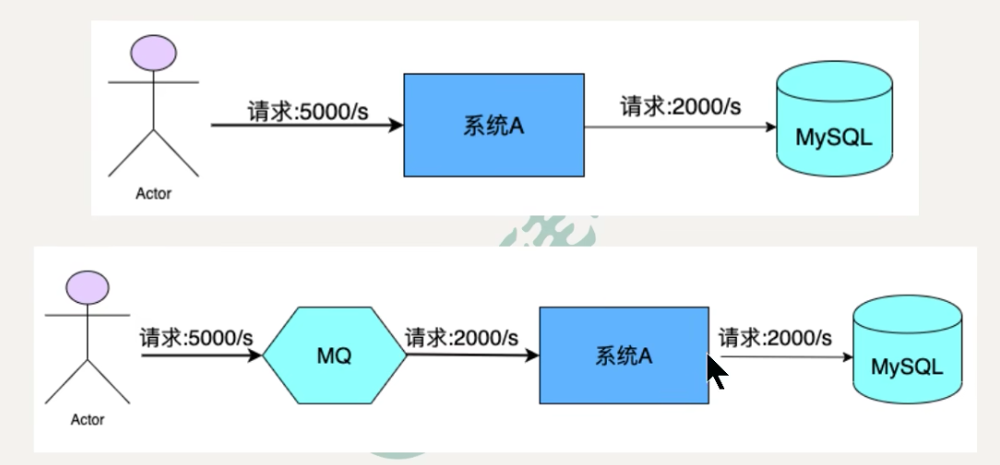

## MQ简介
MQ，Message Queue，是一种提供消息队列服务的中间件，也称为消息中间件，是一套提供了消息生产、存储、消费全过程API的软件系统。消息即数据，一般消息的体量不会很大。

## MQ 用途
### 限流削峰
MQ可以将系统的超量请求暂存其中，以便系统后期可以慢慢进行处理，从而避免了请求的丢失或系统被压垮。

## 异步解耦
上游系统对下游系统的调用，则会大大降低系统的吞吐量与并发度，且系统耦合度太高。而异步调用则会解决这些问题。所以两层之间若要实现由同步到异步的转化，一般做法就是，在这两层间添加一个MQ层。

## 数据收集
分布式系统会生产海量数据流，如：业务日志、监控数据、用户行为等，针对这些数据流进行实时或批量采集汇总，然后对这些数据流进行大数据分析，通过MQ完成此类数据收集是最好的选择。

## RocketMQ如何保证消息不丢失？
将消息流程分为三大部分，每一部分都有可能丢失数据
- 生产阶段：Producer通过网络将消息发送给Broker，这个发送可能会发生丢失，比如网络延迟不可用等
- 存储阶段：Broker肯定是先把消息放到内存的，然后根据刷盘策略持久化到硬盘中，如果刚收到Producer的消息，放入内存，但是异常宕机了，导致消息丢失
- 消费阶段：消费失败。比如先提交ack再消费，处理过程中出现异常，该消息就出现了丢失。

解决方案：
- 生产阶段：使用同步发送失败重试机制；异步发送重写回调方法检查发送结果；ack确认机制
- 存储阶段：同步刷盘机制；集群模式采用同步复制。
- 消费阶段：正常消费处理完成才提交ack；如果处理异常返回重试标识

## RocketMQ是如何发送消息的
RocketMQ 发送消息的过程如下：
1. **生产者发送消息**：生产者首先将消息发送给 NameServer，NameServer 根据 Topic 的配置信息找到对应的 Broker 集群，并返回给生产者 Broker 的地址。

2. **Broker 接收消息**：生产者根据 NameServer 返回的 Broker 地址，选择一个合适的 Broker 发送消息。Broker 接收到消息后，将消息存储到磁盘，并生成一个消息 ID。

3. **刷盘和复制**：Broker 在将消息存储到磁盘后，会进行刷盘操作，将消息刷写到磁盘上的 CommitLog 文件中。同时，Broker 还会将消息复制到其他 Broker 节点上，以实现消息的高可用性和容错性。

4. **消息索引**：Broker 会将消息的索引信息写入到索引文件中，以支持快速的消息查询。

5. **消费者订阅消息**：消费者通过 NameServer 订阅感兴趣的 Topic，并获取到对应的 Broker 地址。

6. **Broker推送消息**：当有消息到达 Broker 时，Broker 会根据消费者的订阅信息，将消息推送给对应的消费者。

7. **消费者消费消息**：消费者接收到消息后，进行消费处理。消费者可以通过拉取模式或推送模式来获取消息。

8. **消息确认**：消费者在消费完成后，会向 Broker 发送消息确认，告知 Broker 已经成功消费该消息。

通过上述过程，RocketMQ 实现了高性能、可靠的消息发送和消费功能。同时，RocketMQ 还支持消息的顺序性和事务性，以满足不同场景下的需求。

 