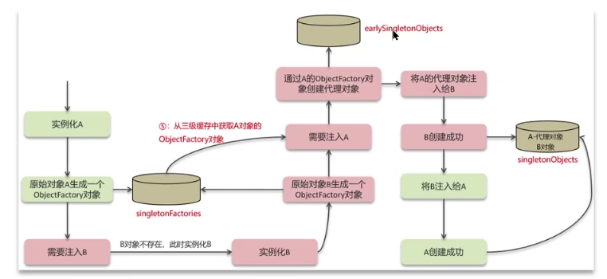
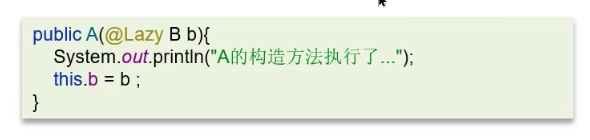
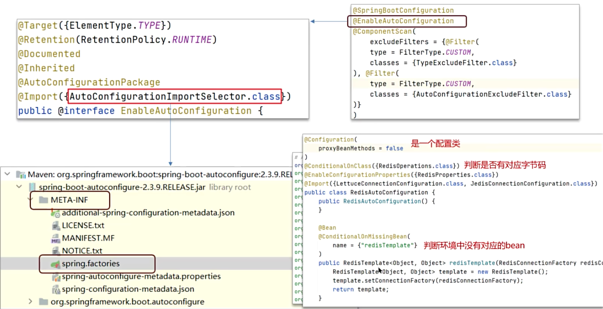
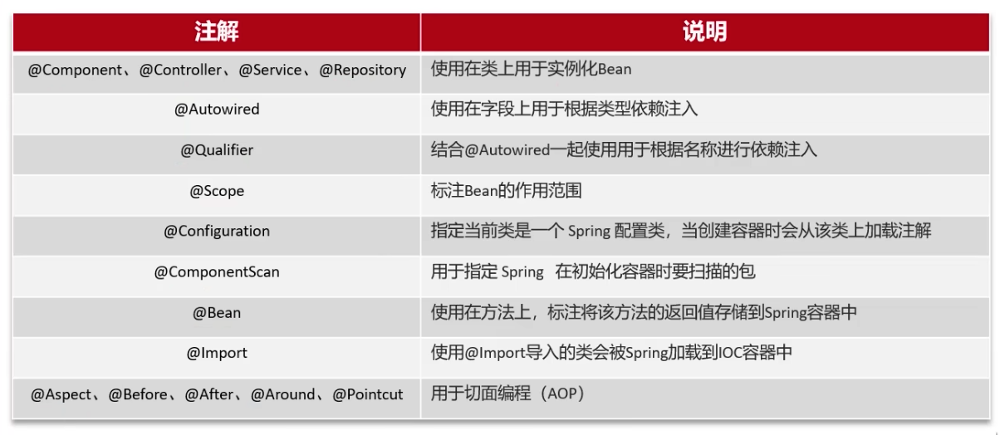
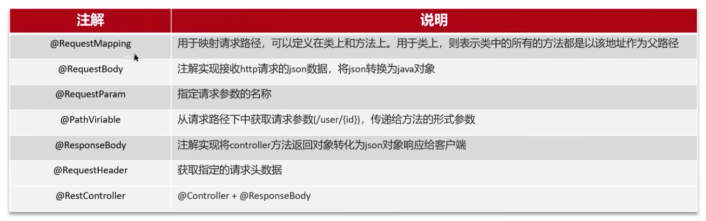
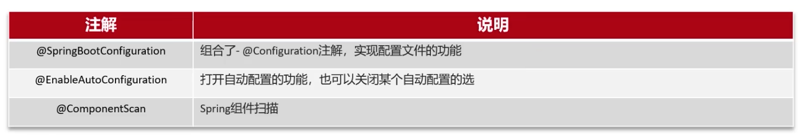

## Spring框架中的单例bean是线索安全的吗？
不是线索安全的
Spring框架中有一个@Scope注解，默认的值就是singleton，单例的。
因为一般在spring的bean的中都是注入无状态的对象，没有线索安全问题，如果在bean中定义了可修改的成员变量，是要考虑线索安全问题的，可以使用多例或者加锁来解决

## 什么是AOP
面向切面编程，用于将那些与业务无关，但却对多个对象产生影响的公共行为和逻辑，抽取并封装为一个可重用的模块，这个模块被命名为"切面"（Aspect）,减少系统中的重复代码，降低了模块间的耦合度，同时提高了系统的可维护性。

## 你们项目中有没有使用到AOP
记录操作日志，缓存，Sping实现的事务
核心是：使用aop中的环绕通知+切点表达式，通过环绕通知的参数获取请求方法的参数（类、方法、注解、请求方式等），获取到这些参数以后，保存到数据库。

## Spring中的事务是如何实现的
其本质是通过aop功能，对方法前后进行拦截，在执行方法之前开启事务，在执行完目标方法之后根据执行情况提交或者回滚事务。

## Spring中事务失效的场景有哪些
- 异常捕获处理，自己处理了异常，没有抛出，解决方法：手动抛出异常
- 抛出检查异常，解决方法：rollbackFor属性为Exception
- 非public方法导致的事务失效，解决方法：改为public

## Spring的bean的生命周期
- 通过BeanDefinition获取bean的定义信息
- 调用构造函数实例化bean
- bean的依赖注入
- 处理Aware接口（BeanNameAware、BeanFactoryAware、ApplicationContextAware）
- Bean的后置处理器BeanPostProcessor-前置
- 初始化方法（InitializingBean、ini-method）
- Bean的后置处理器BeanPostProcessor-后置
- 销毁bean

## Spring中的循环引用
- 循环依赖：循环依赖其实就是循环引用，也就是两个或两个以上的bean互相持有对方，最终形成闭环。比如A依赖于B，B依赖于A
- 循环依赖在spring中是允许存在，spring框架依据三级缓存已经解决了大部分的循环依赖
    - 一级缓存：单例池，缓存已经经历了完整的生命周期，已经初始化完成的bean对象
    - 二级缓存：缓存早期的bean对象（生命周期还没走完）
    - 三级缓存：缓存的是ObjectFactory，表示对象工厂，用来创建某个对象的

## 构造方法出现了循环依赖怎么解决？
A依赖于B，B依赖于A，注入方式是构造函数
原因：由于bean的生命周期中构造函数是第一个执行的，spring框架并不能解决构造函数的依赖注入
解决方案：使用@Lazy进行懒加载，什么时候需要对象再进行bean对象的创建

## SpringMvc的执行流程知道吗
### 视图版本的MVC
1. 用户发送出请求到前端控制器DispatcherServlet
2. DispatcherServlet收到请求调用HandlerMapping（处理器映射器）
3. HandlerMapping找到具体的处理器，生成处理器对象及处理器拦截器（如果有），再一起返回给DispatcherServlet
4. DispatcherServlet调用HandlerAdapter（处理器适配器）
5. HandlerAdapter经过适配调用具体的处理器（Handler/Controller）
6. Controller执行完成返回ModelAndView对象
7. HandlerAdapter将Controller执行结果ModelAndView返回给DispatcherServlet
8. DispatcherServlet将ModelAndView传给ViewReslover（视图解析器）
9. ViewReslover解析后返回具体View（视图）
10. DispatcherServlet根据View进行渲染视图（即将模型数据填充至）
11. DispatcherServlet响应用户

### 前后端开发，接口开发的MVC
1. 用户发送出请求到前端控制器DisPatcherServlet
2. DispatcherServlet收到请求调用HandlerMapping（处理器映射器）
3. HandlerMapping找到具体的处理器，生成处理器对象及处理器拦截器，再一起返回给DispatchServlet
4. DispatcherServlet调用HandlerAdapter（处理器适配器）
5. HandlerAdapter经过适配调用具体的处理器（handler/Controller）
6. 方法上添加了@ResponseBody
7. 通过HttpMessageConverter来返回结果转化为Json并响应 

## SpringBoot自动配置原理
1. 在SpringBoot项目中的引导类上有一个注解@SpringBootApplication，这个注解是对三个注解进行了封装，分别是：
   - @SpringBootConfiguration
   - @EnableAutoConfiguration
   - @ComponentScan
2. 其中@EnableAutoConfiguration是实现自动化配置的核心注解。该注解通过@import注解导入对应的配置选择器。
内部就是读取了该项目和该项目引用的jar包的classpath路径下META-INF/spring.factories文件中的所配置的类的全类名，在这些配置类中所定义的Bean会根据条件注解所指定的条件来决定是否需要将其导入到Spring容器中。
3. 条件判断会有像ConditionalOnClass这样的注解，判断是否有对应的class文件，如果有则加载该类，把这个配置类的所有的Bean放入spring容器中使用。

## Spring的常见注解有哪些？

## SpringMVC的常见注解有哪些？

## SpringBoot常见注解有哪些？
