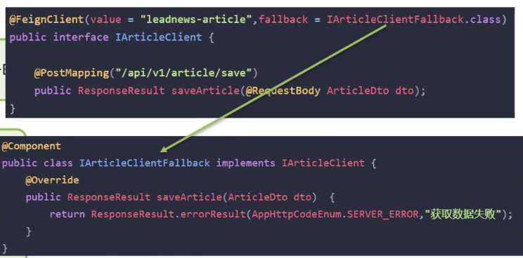

## SpringCloud 五大组件有哪些？
### 官方的五大组件：
- Eureka 注册中心
- Ribbon 负载均衡
- Feign 远程调用
- Hystrix 服务熔断
- Zuul/GateWay 网关

### 阿里巴巴的五大组件
- Nacos 注册中心/配置中心
- Ribbon 负责均衡
- Feign 服务调用
- Sentinel 服务调用
- Gateway 服务网关

## 服务注册和发现是什么意思？Spring Cloud 如何实现服务注册发现？
我们当时项目采用的eureka作为注册中心，这个也是Spring Cloud体系中的一个核心组件
- 服务注册：服务提供者需要把自己的信息注册到eureka，由eureka来保存这些信息，比如服务名称、ip、端口等等。
- 服务发现：消费者向eureka拉取服务列表信息，如果服务提供者有集群，则消费者会利用负载均衡算法，选择一个服务发起调用
- 服务监控：服务提供者会每隔30秒向eureka发送心跳，报告健康状态，如果eureka服务90秒没收到心跳，从eureka中剔除

## nacos 与 eureka 的区别
- Nacos与eureka的共同点（注册中心）
  - 都支持服务注册和服务拉取
  - 都支持服务提供者心跳方式做健康检测
- Nacos与Eureka的区别
  - Nacos支持服务端主动检测提供者状态：临时实例采用心跳模式，非临时实例采用主动检测模式
  - 临时实例心跳不正常被剔除，非临时实例则不会剔除
  - Nacos支持服务列表变更的消息推送模式，服务列表更新及时
  - Nacos集群默认采用AP方式，当集群中存在非临时实例时，采用CP模式，Eureka采用AP方式
- Nacos还支持了配置中心，eureka则只有注册中心，也是选择使用nacos的一个重要原因

## Ribbon负载均衡策略有哪些？
- RoundRobinRule 简单轮询服务列表来选择服务器
- WeightedResponseTimeRule 按照权重来选择服务器，响应时间越长，权重越小
- RandomRul 随机选择一个可用的服务器
- BestAvailableRule 忽略哪些短的服务器，并选择并发数较低的服务器
- RetryRule 重试机制的选择逻辑
- AvailabilityFilteringRule 可用性敏感策略，先过滤非健康的，再选择连接数较小的实例
- ZoneAvoidanceRule 以区域可用的服务器为基础进行服务器的选择，使用Zone对服务器进行分类，这个Zone可以理解为一个机房，一个机架等，而后再对Zone内的多个服务器做轮询，如果没有区域，就只做轮询。

## 项目负责均衡如何实现的？
微服务的负载均衡主要使用了一个组件Ribbon，比如，我们在使用feign远程调用的过程中，底层的负责均衡就是使用了ribbon

## 如果想自定义负载均衡策略如何实现？
两种方式：
1. 创建类实现IRule接口，可以指定负载均衡策略，这是全局的
2. 在客户端的配置文件中，可以配置某一个服务调用的负载均衡策略，这是局部的

## 什么是服务雪崩，怎么解决这个问题？
服务雪崩是一个服务失败了，导致整条链路的服务都失败的情形
解决方案：
- 服务降级：服务降级是服务自我保护的一种方式，或者保护下游服务的一种方式，用于确保服务不会受到请求突增影响变得不可用，确保服务不会崩溃，一般在实际开发中与feign接口整合，编写降级逻辑如下图

- 服务熔断：默认是关闭的，需要手动打开，在引导类上添加注解：@EnableCircuitBreaker，如果检测到10秒内请求的失败率超过50%，就触发熔断机制，之后每隔5秒重新尝试请求微服务，如果微服务不能响应，继续走熔断机制，如果微服务可访问，则关闭熔断机制，恢复正常请求。

## 微服务是怎么监控的
项目中采用skywalking进行监控的
1. skywalking主要可以监控接口、服务、物理实例的一些状态，特别是在压测的时候可以看到众多服务中哪些服务和接口比较慢，我们可以针对性的分析和优化。
2. 我们还在skywalking设置了告警规则，特别是在项目上线以后，如果报错，我们分别设置了可以给相关负责人发送短信和邮件，第一时间知道项目的bug情况，第一时间修复
