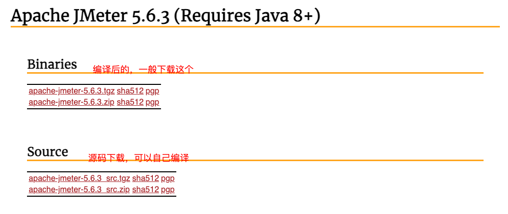
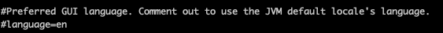
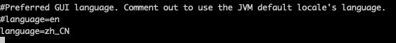

# JMeter 在Mac下的安装
## 下载地址：https://jmeter.apache.org/download_jmeter.cgi


## JMeter启动
解压文件后，进入bin目录，通过 ``sh jmeter`` 来启动Jmeter

## 优化Jmeter
为了方便在命令窗口通过输入jmeter 来启动jmeter，我们对 ~/.bash_profile 文件进行修改，将jmeter配置到环境变量中，添加如下配置到 .bash_profile中：
```
export JMETER_HOME=/Applications/apache-jmeter-5.6.3
export PATH=$JAVA_HOME/bin:$PATH:.:$JMETER_HOME/bin:$PATH
export CLASSPATH=.:$JAVA_HOME/lib/dt.jar:$JAVA_HOME/lib/tools.jar:$JMETER_HOME/lib/ext/ApacheJMeter_core.jar:$JMETER_HOME/lib/jorphan.jar:$JMETER_HOME/lib/logkit-2.0.jar
```
然后，再执 ``source ~/.bash_profile``，这样就可以输入``jmeter``即可启动jmeter

## 配置语言为中文
通过编辑apache-jmeter-5.6.3安装文件夹下bin目录下的jmeter.properties，修改如下：


修改为

