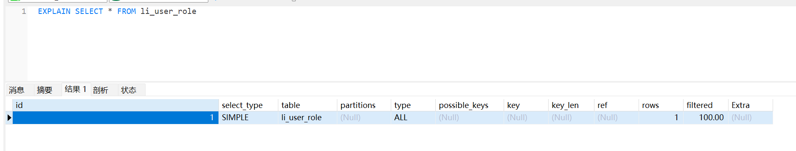
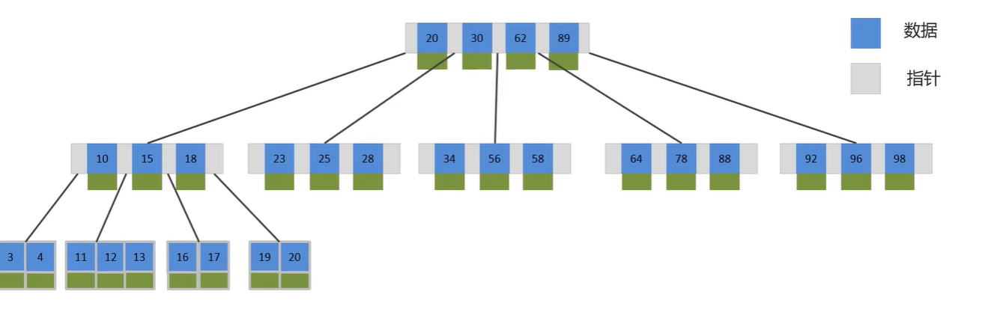
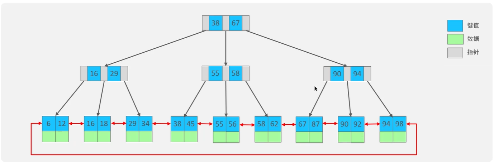
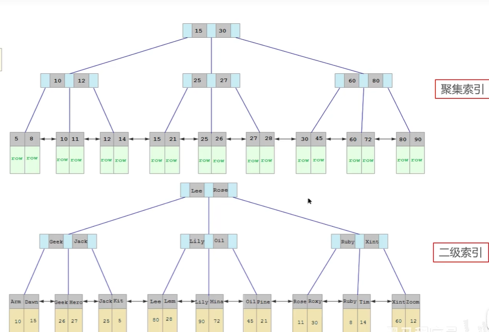
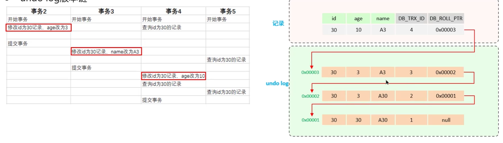

## 出现慢查询情况
- 聚合查询
- 多表查询 
- 表数据量过大查询
- 深度分页查询

出现的现象是页面加载过慢，接口压测响应时间过长
## 定位慢查询
1. 调试工具Arthas 
2. 利用运维工具Skywalking，来监测哪个接口的sql是比较慢的
3. 在mysql中开启慢日志查询，一般设置的值是2秒，一旦执行超过2秒就会记录到日志中，但开启这个只能是在开发调试阶段，生产环境不建议开启，会拖慢mysql性能
    - 慢查询日志记录了所有执行时间超过指定参数（long_query_time，单位：秒，默认10秒）的所有sql语句的日志，如果要开启慢查询日志，需要再mysql的配置文件（/etc/my.cnf）中配置如下
      ``
         show_query_log=1 #开启慢日志查询开关
         log_query_time=2 # 设置慢日志的时间为2秒，sql语句执行时间超过2秒，就会视为慢查询，记录查询日志
      ``
    日志文件位置在：/var/lib/mysql/localhost-show.log，开始慢日志查询一般在调试阶段，生产环境不建议开启，因为会影响性能
## sql语句执行很慢，如何分析
采用mysql自带的分析工具explain执行计划

- type 这条sql的连接的类型，性能由好到差为NUll，system、const、eq_ref、ref、range、index、all
   - system：查询系统中的表
   - const：根据主键查询
   - eq_ref：主键索引查询或唯一索引查询
   - ref：索引查询
   - range：范围查询
   - index：索引树扫描
   - all：全盘扫描
- possible_key 当前sql可能会使用到的索引
- key 当前sql实际命中的索引
- key_len 索引占用的大小
- extra 额外的优化建议（比如 Using where;Using index：表示查找使用了索引，需要的数据都在索引列中能找到，不需要回表查询数据。Using index condition：表示查找使用了索引，但是需要回表查询数据）
- 通过key和key_len检查是否命中了索引，就是索引本身存在是否有失效的情况
- 通过type字段查看sql是否有进一步的优化空间，是否存在全索引扫描或全盘扫描
- 通过extra建议判断，是否出现了回表的情况，如果出现了，可以尝试添加索引或修改返回字段来修复

## 什么是索引
索引是一钟用于快速查询和检索数据的数据结构，其本质可以看成一种排好序的数据结构。

mysql默认使用的索引底层数据结构是B+树

## 数据结构对比
### B树
B树是一种多叉路衡查找树，每个节点可以有多个分支，B树每个节点最多存储4个key，每个节点都有key和数据

### B+树
B+树是在B树基础上的一种优化，使其更适合实现外存储索引结构，InnoDB存储引擎就是用B+树实现其索引结构，叶子节点存储数据，非叶子节点不存储数据，存储指针，非叶子节点负责导航找到叶子节点，获取数据。

B树与B+树对比：
1. 磁盘读写代价B+树更低，因为b树的节点都存储指针和数据，查找时候会带着其他节点的数据，b+树非叶子节点只存储指针，不存储数据，只负责导航找到叶子节点数据，就不会有多余的其他节点数据，所以读写代价更低
2. 查询效率B+树更加稳定，因为b+树的数据都存储在叶子节点上，不过从哪个非叶子节点查找下来，效率都差不多的，所以效率稳定
3. B+树便于扫库和区间查询，因为非叶子节点都是双向链表的，找一个数据，就能一次性查找出区间的数据了。

## 什么是聚簇索引（聚集索引），二级索引（非聚集索引）
- 聚集索引：将数据存储与索引放到一块，索引结构的叶子节点保存了行数据，这索引是必须有的，而且只有一个
- 二级索引：将数据与索引分开存储，索引结构的叶子节点关联的是对应的主键，这索引可以存在多个

### 聚集索引选取规则：
- 如果存在主键，主键索引就是聚集索引
- 如果不存在主键，将使用第一个唯一索引作为聚集索引
- 如果表没有索引，或没有合适的唯一索引，则InnoDB会自动生成一个rowId作为隐藏的聚集索引

### 回表查询
通过二级索引找到对应的主键值，到聚集索引中查找整行数据，这个过程就是回表查询 

## 覆盖索引
覆盖索引是指查询语句使用了索引，并且需要返回的列，都能根据该索引全部查找到
- 如果使用id查询，直接走聚集索引查询，一次索引扫描，直接返回数据，性能高。
- 如果返回的列中没有创建索引，有可能会触发回表查询，尽量避免使用select *

## mysql超大分页问题
使用覆盖索引加子查询解决
``select * from table t inner join (select id from table order by id limit 9999999,10) t2 where t.id=t2.id``

思路：子查询先查出id，并排序，这样就走覆盖索引，再分页，然后再关联id

## 索引创建原则有哪些
1. 针对于数据量比较大，且查询比较频繁的表建立索引（一般表超过10万，就要创建索引了，这样增加用户体验） （重要）
2. 针对于常作为查询条件（where）、排序（order by）、分组（group by）操作的字段建立索引 （重要）
3. 尽量选择区分度高的列作为索引，尽量建立唯一索引，区分度（就是唯一值）越高，使用索引的效率越高
4. 如果是字符串类型的字段，字段的长度较长，可以针对于字段的特点，建立前缀索引
5. 尽量使用联合索引，减少单列索引，查询时，联合索引很多时候可以覆盖索引，节省存储空间，避免回表，提高查询效率 （重要）
6. 要控制索引的数量，索引并不是多多益善，索引越多，维护索引结构的代价就越大，会影响增删改查的效率 （重要）
7. 如果索引列不能存储null值，请在创建表时候使用not null 约束他，当优化器知道每列是否包含null值时，他可以更好的确定哪个索引最有效的用于查询

## 什么情况下索引会失效
1. 如果索引有多列，要遵守最左前缀法则，指的是查询从索引的最左前列开始，并且不能跳过其中一个索引列。跳过就会导致索引失效，列如：select * from user where name= 'ab' and address = 'abcd'，user表中的索引列是按照 name，status，address顺序的，现在语句跳过status，就导致索引失效
2. 范围查询右边的列不能使用索引，否则会导致索引失效 例如：select * from user where name= 'ab' and status > '1' and address = 'abcd' ,其中三个字段都是建索引的，由于status范围查询了，导致address列索引失效
3. 不要在索引列上进行运算操作，否则索引会失效，例如：select * from user where substring(name,3,2)= '科技'
4. 字符串类型的字段，不加单引号，索引会失效，例如：select * from user where status = 0，本来status是字符串类型，现在等于0，没加单引号，mysql的优化器会自动的进行类型转换，导致索引失效
5. 以%开头的like模糊查询，索引会失效，如果仅仅是尾部模糊匹配就不会失效，列如：select * from user where name like '%abc%' 或者 name like '%abc'，只有 name like 'abc%'，索引才不会失效

## sql的优化
- 表的设计优化（我们参考阿里开发手册《嵩山版》里面优化手段）
    - 比如设置合适的数值（tinyint int bigint）,要根据实际情况选择
    - 比如设置合适的字符串类型（char和varchar） char固定长度，效率高，varchar可变长度，效率稍低
- 索引优化 （参考创建索引规则和索引失效的优化）
- sql语句优化
    - select语句务必指定字段名称，避免直接使用select *，这样避免回表查询，回表查询效率低下
    - sql语句要避免造成索引失效的写法
    - 尽量用union all替代union，因为union 会过滤掉重复数据，多一次操作，效率低，union all就不会，数据全部展示
    - 避免在where语句中对索引字段进行表达式操作，也是就是，select * from user where substring(name,3,2)= '科技'，索引字段避免这样操作函数
    - join 优化，能用inner join 就不用left join right join ，如果要使用左连接右连接，一定要以小表取得大表，内连接inner join会对两个表进行优化，优化把小表放到外边，大表放到里面，左连接和右连接就不会调整大小表顺序
- 主从复制，读写分离
- 分库分表

## 事务的特性是什么
事务是一组操作的集合，它是一个不可分割的工作单位，事务会把所有的操作作为一个整体一起向系统提交或撤销操作请求，即这些操作要么同时成功，要么同时失败

### ACID是什么
- 原子性（Atomicity）： 事务是不可分割的最小操作单元，要么全部成功，要么全部失败
- 一致性（Consistency）： 事务完成时，必须使所有的数据都保持一致状态
- 隔离性（Isolation）：数据库系统提供的隔离机制，保证事务在不受外部并发操作影响的独立环境下运行
- 持久性（Durability）：事务一旦提交或回滚，他对数据库中的数据的改变就是永久的

## 并发事务带来那些问题
- 脏读：一个事务读到另一个事务还没提交的数据
- 不可重复读：一个事务先后读取到同一条记录，但两次读取的数据不同
- 幻读：一个事务按照条件查询数据时，没有对应的数据星，但在插入数据时，又发现这行数据已经存在，好像出现了幻影

### 解决事务并发问题
可以使用隔离级别来解决：
- read uncommitted 未提交读，脏读、不可重复读、幻读都解决不了
- read committed 读已提交，解决了脏读，不可重复读、幻读都解决不了
- repeatable read 可重复读（mysql默认隔离级别）：解决了脏读、不可重复读，幻读解决不了
- serializable 串行化：解决了所有问题，但效率性能很低

## undo log和redo log的区别
- 缓冲池（buffer pool）：主内存中的一个区域，里面可以缓存磁盘上经常操作的真实数据，在执行增删改查操作时，先操作缓冲池中的数据，若缓冲池中没有数据，则从磁盘加载并缓存。缓冲池中数据以一定频率刷新到磁盘，这样就减少了磁盘io，加快处理速度
- 数据页（page）：是InnoDB存储引擎磁盘管理的最小单元，每个页的大小默认为16kb，页中的存储的是行数据

### redo log
重做日志，记录的是事务提交时数据页的物理修改，是用来实现事务的持久性。改日志文件由两部分组成：重做日志缓冲（redo log buffer）以及重做日志文件（redo log file），前者是在内存中，后者是在磁盘中。当事务提交之后会把所有修改信息都存到该日志文件中，用于在刷新脏页到磁盘，发生错误时，进行数据恢复使用。

### undo log
回滚日志，用于记录数据被修改前的信息，作用包含两个：提供回滚和mvcc（多版本并发控制）。undo log和redo log记录物理日志不一样，他是逻辑日志。
- 可以认为当delete一条记录时，undo log中会记录一条对应的insert记录（反向操作语句），以保证事务回滚时，还原数据
- 当update一条记录时（``update user set name = "李四" where id = 1;   ---修改之前name=张三`` ），他记录一条对应相反的update记录(``update user set name = "张三" where id = 1;``)，当执行rollback时，就可以从undo log中的逻辑记录读取到相应的内容并进行回滚。
- undo log 可以实现事务的一致性和原子性

## 事务中的隔离性是如何保证的
- 锁（排他锁）：如果一个事务获取了一个数据行的排他锁，其他事务就不能再获取该行的其他锁
- mvcc（Multi-Version Concurrency Control）:多版本并发控制，指维护一个数据的多个版本，使得读写操作没有冲突。mvcc的具体实现，主要依赖于数据库记录中的隐式字段、undo log日志、readView.

### MVCC实现原理
- 记录中的隐藏字段（db_trx_id、db_roll_ptr、db_row_id）
    - db_trx_id: 最近修改事务id，记录插入这条记录或最后一次修改该记录的事务id
    - db_roll_id；回滚指针，指向这条记录的上一个版本，用于配合undo log，指向上一个版本。
    - db_row_id：隐藏主键，如果表结构没有指定主键，将会生成该隐藏字段并使用他，如果由指定主键，该字段没什么用
- undo log
    - 回滚日志，在insert、update、delete的时候产生的便于数据回滚的日志
    - 当insert的时候，产生的undo log日志只在回滚时需要，在事务提交后，可被立即删除
    - 而update、delete的时候，产生的undo log日志不仅在回滚时需要，mvcc版本访问也需要，不会立即被删除
- undo log 版本链

不同事务或相同事务对同一条记录进行修改，会导致该记录的undo log生成一条记录版本链表，链表的头部时最新的旧记录，链表尾部时最早的旧记录
-  

