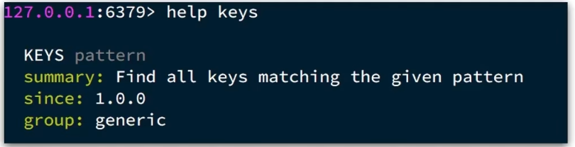

## Redis数据结构
- 基本类型：String、Hash、List、Set、SortedSet
- 特殊类型：GEO、BitMap、HyperLog

## redis通用命令
通用命令是部分数据类型的，都可以使用的指令，常见的有：
- KEYS：查看符合模版的所有key，**注意，这命令不建议在生产环境设备上使用**
- DEL：删除一个指定的key
- EXISTS：判断key是否存在
- EXPIRE：给一个key设置有效期，有效期到期时该key会被自动删除
- TTL：查看一个key的剩余有效期

通过help [command] 查看一个命令的具体用法，例如：

## String类型的常见命令
String的常见命令有：
- set：添加或者修改已经存在的一个String类型的键值对
- get：根据key获取String类型的value
- mset：批量添加多个String类型的键值对
- mget：根据添加多个String类型的键值对
- incr：让一个整型的key自增1
- incrby：让一个整型的key自增并指定步长，例如：incrby num 2 让num值自增2
- incrbyfloat：让一个浮点型的数字自增并指定步长
- setnx：添加一个String类型的键值对，前提是这个key不存在，否则不执行
- setex：添加一个String类型的键值对，并且指定有效期

## Hash类型的常见命令
Hash的常见命令有：
- hset key field value: 添加或者修改hash类型key的field的值
- hget key field：获取一个hash类型可以的field的值
- hmset：批量添加一个hash类型key的多个field的值
- hmget：批量获取一个hash类型key的多个field的值
- hgetall：获取一个hash类型的可以中的所有field和value
- hkeys：获取一个hash类型的key中的所有的field
- hvals：获取一个hash类型的key中的所有的value
- hincrby：让一个hash类型key的字段自增并指定步长
- hsetnx：添加一个hash类型的key的field值，前提是这个field不存在，否则不执行

## List类型
redis中的list类型与java中的linkedList类似，可以看作是一个双向链表结构，即可以支持正向检索和也可以支持反向检索

特征也与linkedList类似：
- 有序
- 元素可以重复
- 插入和删除快
- 查询速度一般

### list类型的常见命令
- lpush：向列表左侧插入一个或多个元素
- lpop：移除并返回列表左侧的第一个元素，没有则返回nil
- rpush：向列表右侧插入一个或多个元素
- rpop：移除并返回列表右侧的第一个元素
- lrange：返回一段角标范围内的所有元素
- blpop和brpop：与lpop和rpop类似，只不过在没有元素时等待指定时间，而不是直接返回nil

## Set类型
Redis的Set结构与java中的hashSet类似，可以看作是一个value为null的hashMap。因为也是一个hash表

因此具备与hashSet类似的特征：
- 无序
- 元素不可重复
- 查找快
- 支持交集、并集、差集等功能

### set的常见命令：
- sadd：向set中添加一个或多个元素
- srem：移除set中的指定元素
- scard：返回set中元素的个数
- sismember：判断一个元素是否存在于set中
- smembers：获取set中的所有元素
- sinter key1 key2：求key1与key2的交集
- sdiff key1 key2：求key1与key2的差集
- sunion key1 key2：求key1和key2的并集

## SortedSet类型
redis的SortedSet是一个可排序的set集合，与java中的TreeSet有些类似，但底层数据结构却差别很大。SortedSet中的每一个元素都带有一个score属性，可以基于score属性对元素排序，底层的实现是一个跳表加hash表。

SortedSet具备下列特性：
- 可排序
- 元素不重复
- 查询速度快

因为SortedSet的可排序性，经常被用来实现排行榜这样的功能。

### SortedSet的常见命令：
- zadd：添加一个或多个元素到sorted set，如果已经存在则更新其score值
- zrem：删除sortedset的一个指定元素
- zscore：获取sorted set中的指定元素的sore值
- zrank：获取sorted set中的指定元素的排名
- zcard：获取sorted set中的元素个数
- zcount：统计score值在给定范围内的所有元素的个数
- zincrby：让sorted set中的指定元素自增，步长为指定的increment值
- zrange：按照score排序后，获取指定排名范围内的元素
- zrangebyscore：按照score排序后，获取指定score范围内的元素
- zdiff、zinter、zunion：求差集、交集、并集 

注意：所有的排名默认都是升序，如果要降序则在命令的z后面添加rev即可。