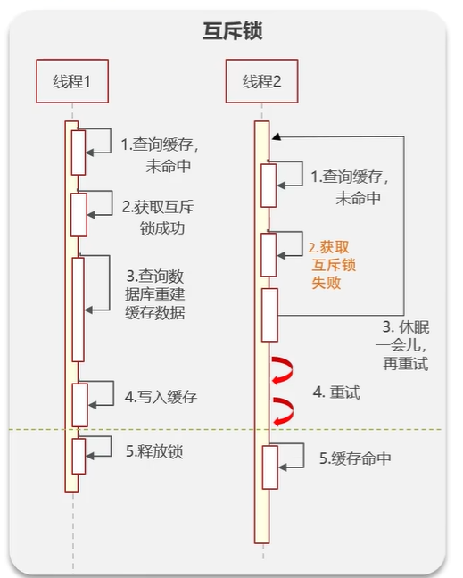

## 什么是Redis缓存穿透，怎么解决
缓存穿透是指查询一个不存在的数据，数据库也查不到数据也不会直接写入缓存，就会导致每次请求查这个不存在数据，都查到数据库了，如果大量这样请求就会导致数据库挂掉。

### 解决方法
- 解决方案一：缓存空数据，查询返回的数据为空，就把这个空数据进行缓存，这方案比较消耗内存，可能会发生数据不一致的问题
- 解决方案二：布隆过滤器，底层是先去初始化一个比较大数组（位图bitmap），里面只存放的二进制0或1，一开始都是0，当一个key来了之后经过3次hash计算，找到数据的下标然后把数组中原来的0改为1，这样的话，三个数组的位置就能标明一个key的存在，查找过程也是一样的。缺点就是会产生一定的误判，不过可以设置这个误判率，一般设置5%，设置太小就得增加数组的长度，就很占内存，不划算。误判是必然存在的，5%一般项目都能接受了。不至于高并发下压到数据库。
  - 布隆过滤器实现方案：可以使用redisson、guava

## 什么是缓存击穿，怎么解决
缓存击穿的意思是对于设置了过期时间的key，缓存在某个时间点过期的时候，刚好这时间点对这个key有大量的并发请求过来，这些请求发现缓存过期一般都从后端数据库加载数据并回设到缓存，这个时候大量并发的请求可能会瞬间把数据库压垮。

### 解决方案有两种
- 第一种方案：可以使用互斥锁（分布式锁），当缓存失效时，不用立刻去数据库加载数据，先使用redis的setnx去设置一个互斥锁，当操作成功返回再进行加载数据的操作并回设缓存，否则重试get缓存的方法

- 第二种方案：（逻辑过期）设置当前key的逻辑过期，意思就是设置key时候，给这个key设置一个过期字段一起存进缓存，同时不给这个key设置过期时间，当查询的时候，从redis取出该key后进行判断存的过期字段时间是否过期，如果过期了就开通另外一个线程进行数据同步，当前key的线程正常返回数据，但这个数据还是旧数据。新数据等同步数据完成，下次查询就是新的数据了。

这两种方案都有利弊，如果要求数据一致性比较强，就建议采用互斥锁方案，但性能就不高，如果要考虑高可用性，就选择key的逻辑过期方案，但这个方案就是数据达不到一致性。

## 什么是缓存雪崩，怎么解决
缓存雪崩就是设置缓存时采用相同的过期时间，导致缓存在某一时刻同时失效，请求就全部转发到数据库，数据库瞬间压力过大导致崩溃，挂掉。

解决方案主要是可以将缓存失效时间分散开，比如可以在原有的过期时间上加个随机值，比如1到5分钟，这样每个缓存的过期时间重复率就会降低，就很难引发集体失效了。

其他方案：
- 利用Redis集群提高服务的可用性
- 给缓存业务添加降级限流策略
- 给业务添加多级缓存

## 双写一致性
当修改了数据库的数据也要同时更新缓存的数据，缓存和数据库的数据要保持一致

**注意到不管时先删除缓存再删除数据库，还是先删除数据库再删除缓存，都会出现脏数据问题，延迟双删也会出现脏数据问题**

### 解决双写一致性方案
- 分布式锁，保证强一致性，但性能比较低

- 读写锁(redisson提供的)，相比分布式锁性能高些，也能保证一致性

读锁代码实现：

写锁代码实现

- 异步通知保证数据的最终一致性

- 基于canal的异步通知

## redis数据的持久化是怎么做的
在redis中提供了两种数据持久化的方式：1.RDB 2.AOF
### RDB
全称redis database backup file（redis数据备份文件），也被叫做redis数据快照，简单来说就是把内存中的所有数据都记录到磁盘中，当redis实例故障重启后，从磁盘读取快照文件，恢复数据，下面命令是手动备份数据，一般使用bgsave来备份

redis内部由触发RDB的机制，可以在redis.conf文件修改，如下：

**RDB的执行原理**： 
bgsave开始时会fork主进程得到子进程，子进程共享主进程的内存数据，完成fork后读取内存数据并写入RDB文件， 
fork采用的是copy-on-write技术：
- 当主进程执行读操作时，访问共享内存
- 当主进程执行写操作时，则会拷贝一份数据，执行写操作

### 这两种方式，那种恢复比较快
RDB因为是二进制文件，在保存的时候体积是比较小的，它恢复的比较快，但是它可能会丢失数据，比如设置了60秒备份一次，但60秒内redis宕机了就丢失大量数据，通常在项目中也会使用AOF来恢复数据，虽然AOF恢复的速度慢一些，但是它丢失数据的风险要小很多，在AOF文件中可以设置刷盘策略，可以设置为每秒批量写入一次命令，这样可以降低数据丢失风险

### RDB备份是否可以设置为一秒
对于 Redis 的 RDB（Redis Database）快照持久化方式来说，生成快照的时间间隔可以是一秒，是通过配置参数 `save` 来指定的。

在 Redis 的配置文件（redis.conf）中，`save` 参数用于设置生成 RDB 快照的策略。该参数是一个数组，包含多个时间间隔配置项。每一个配置项由两个值组成：一个指定了多少秒之后开始生成快照的时间间隔，另一个指定了在这个时间间隔内至少有多少个键被修改才触发生成快照的条件。

例如，设置 `save` 参数为 `save 1 1`，表示 Redis 每隔一秒检查所有修改的键的数量，只要至少有一个键被修改，就会触发生成快照的操作。这样就可以实现每秒生成一次快照。

然而，需要注意的是，频繁生成 RDB 快照可能会对 Redis 的性能产生一定的影响，因为生成快照需要对当前内存中的数据进行序列化和持久化操作。当 Redis 实例的访问压力较大时，如果频繁生成快照，可能会导致 Redis 的响应性能下降。因此，在设置 `save` 参数时，需要根据具体情况综合考虑性能和数据可靠性之间的平衡。

## redis的数据过期策略有哪些
在redis中提供了两种数据过期删除策略
- 第一种是惰性删除，在设置该key过期时间后，我们不去管他，当需要该key时，我们再检查它是否过期，如果过期就删除，没过期就返回该key
- 第二种事定期删除，就是说每隔一段时间，我们就对一些key进行检查，删除里面过期的key定期清除，定期清除有两种模式：
  - SLOW模式是定时任务，执行频率默认为10hz，每次不超过25ms，可以通过修改配置文件redis.conf中的频率选项来调整这个次数
  - FAST模式执行频率不固定，每次事件循环会尝试执行，但每次间隔不低于2ms，每次耗时不超过1ms。

Redis的过期删除策略是惰性删除加定期删除两种策略进行配合使用

## redis的数据淘汰策略有哪些
数据的淘汰策略：当Redis中的内存不够用时，此时在向Redis中添加新的key，那么Redis就会按照某一种规则将内存中的数据删除掉，这种数据的删除规则被称为内存的淘汰策略。
Redis支持8种不同策略来选择要删除的key：
- noeviction：不淘汰任何key，但内存满时不允许写入新数据，默认就是这种策略
- volatile-ttl：对设置了TTL（过期时间），比较key的剩余TTL值，TTL越小越先被淘汰
- allkeys-random：对全体key，随机进行淘汰
- volatile-random：对设置了TTL的key，随机进行淘汰
- allkeys-lru：对全体key，基于lru算法进行淘汰
- volatile-lfu：对设置了TTL的key，基于LRU算法进行淘汰
- allkeys-lfu：对全体key，基于LFU算法进行淘汰
- volatile-lfu：对设置了TTL的key，基于LFU算法进行淘汰

**LRU算法**：最近最少使用，用当前时间减去最后一次访问时间，这个值越大则淘汰优先级越高

**LFU算法**：最少频率使用，会统计每个key的访问频率，值越小淘汰优先级越高